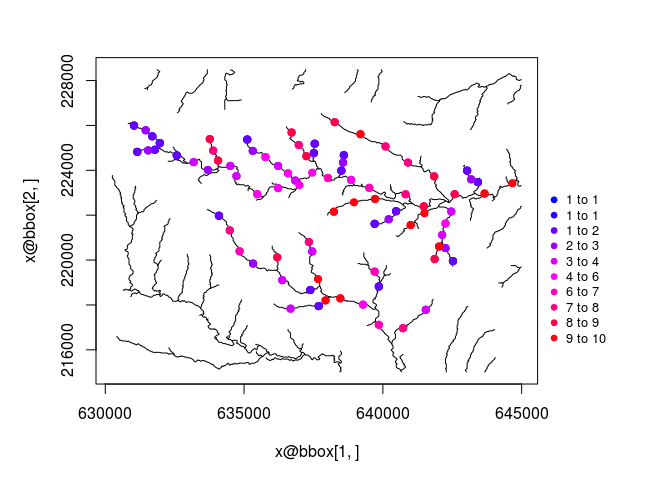
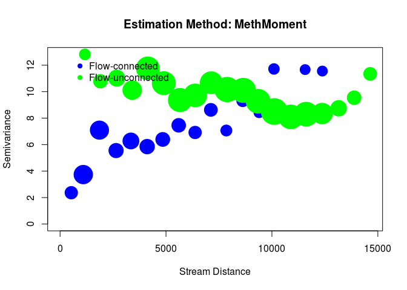

openSTARS
=============


`openSTARS` is an open source implementation of the STARS toolbox (Peterson & Ver Hoef, 2014) using R and GRASS GIS.
It prepares the .ssn object needed for the SSN package.
Currently a DEM is used to derive stream networks (in contrast to STARS, which can clean an existing stream network).

For more information on STARS and SSN, see [their webpage](http://www.fs.fed.us/rm/boise/AWAE/projects/SpatialStreamNetworks.shtml).

Peterson, E. E., & Ver Hoef, J. M. (2014). STARS: An ArcGIS Toolset Used to Calculate the Spatial Information Needed to Fit Spatial Statistical Models to Stream Network Data. J Stat Softw, 56(2), 1–17.


### Installation
A functional installation of [GRASS GIS (>=7.0)](https://grass.osgeo.org/#) with installed addons [r.stream.basins](https://grass.osgeo.org/grass70/manuals/addons/r.stream.basins.html), [r.stream.distance](https://grass.osgeo.org/grass70/manuals/addons/r.stream.distance.html) and [r.stream.order](https://grass.osgeo.org/grass70/manuals/addons/r.stream.order.html) is needed.

The openSTARS package can be installed from github using


```r
install.packages("devtools")
devtools::install_github("edild/openSTARS")
library('openSTARS')
```


### Basic usage

#### Initiate a ephemeral GRASS session:

```r
library(openSTARS)
initGRASS(gisBase = "/usr/lib/grass70/",
          home = tempdir(),
          override = TRUE)
#> gisdbase    /tmp/RtmplENZkj 
#> location    file77470b3f41e 
#> mapset      file7741ba963d6 
#> rows        1 
#> columns     1 
#> north       1 
#> south       0 
#> west        0 
#> east        1 
#> nsres       1 
#> ewres       1 
#> projection  NA
```

#### Load DEM and sites into GRASS:


```r
dem_path <- system.file("extdata", "nc", "elev_ned_30m.tif", package = "openSTARS")
sites_path <- system.file("extdata", "nc", "sites_nc.shp", package = "openSTARS")

import_data(dem = dem_path, sites = sites_path)
#> WARNING: Raster map <dem> already exists and will be overwritten

gmeta()
#> gisdbase    /tmp/RtmplENZkj 
#> location    file77470b3f41e 
#> mapset      PERMANENT 
#> rows        450 
#> columns     500 
#> north       228500 
#> south       215000 
#> west        630000 
#> east        645000 
#> nsres       30 
#> ewres       30 
#> projection  +proj=lcc +lat_1=36.16666666666666 +lat_2=34.33333333333334
#> +lat_0=33.75 +lon_0=-79 +x_0=609601.22 +y_0=0 +no_defs +a=6378137
#> +rf=298.257222101 +towgs84=0.000,0.000,0.000 +to_meter=1
```

The dem is loaded as raster names `dem`, the sites as vector named `sites_o`.
Here's how the data looks like:


```r
dem <- readRAST('dem', ignore.stderr = TRUE)
#> Creating BIL support files...
#> Exporting raster as floating values (bytes=4)
#>    0%   3%   6%   9%  12%  15%  18%  21%  24%  27%  30%  33%  36%  39%  42%  45%  48%  51%  54%  57%  60%  63%  66%  69%  72%  75%  78%  81%  84%  87%  90%  93%  96%  99% 100%
sites <- readVECT('sites_o', ignore.stderr = TRUE)
plot(dem, col = terrain.colors(20))
cols <- colorRampPalette(c("blue", 'red'))(length(sites$value))[rank(sites$value)]
points(sites, pch = 16, col = cols)
```

<!-- -->

#### Derive streams from DEM:

```r
derive_streams()
```


```r
streams <- readVECT('streams_v', ignore.stderr = TRUE)
#> WARNING: 178 points found, but not requested to be exported. Verify 'type'
#>          parameter.
plot(dem, col = terrain.colors(20))
lines(streams, col = 'blue')
points(sites, pch = 16, col = cols)
```

<!-- -->

#### Prepare edges:


```r
calc_edges()
```


```r
edges <- readVECT('edges', ignore.stderr = TRUE)
head(edges@data)
#>   cat rid type_code OBJECTID cat_o netID topo_dim    Length sourceDist
#> 1   1   0         0        0    19    20        2  102.4264   102.4264
#> 2   2   1         0        1    17    20        2   90.0000    90.0000
#> 3   3   2         1        2    20    20        1 1081.2489  1183.6753
#> 4   4   3         0        3    15    15        1 1610.9545  1610.9545
#> 5   5   4         0        4    23    26        2  504.8528   504.8528
#> 6   6   5         0        5     7    26        2  607.2792   607.2792
#>     upDist H2OArea rcaArea
#> 1 1183.675  246.15  100.80
#> 2 1171.249  246.15   97.65
#> 3 1081.249  444.60   98.37
#> 4 1610.955  246.15  178.65
#> 5 2385.807  246.15  171.63
#> 6 2488.234  246.15   98.73
```

`edges` now holds the derived network plus attributes needed for SSN (segment id, network id, upstream distance ( distance from outlet), watershed area, river contributing area, toplogical dimension, segment length, distance from source)


#### Prepare sites:


```r
calc_sites()
```


```r
sites <- readVECT('sites', ignore.stderr = TRUE)
edges <- readVECT('edges', ignore.stderr = TRUE)
plot(dem, col = terrain.colors(20))
lines(edges, col = 'blue')
points(sites, pch = 16, col = cols)
```

<!-- -->

```r
head(sites@data)
#>   cat cat_ value       dist       xm       ym pid locID netID rid   upDist
#> 1   1    1     1  79.907826 631046.1 226074.1   1     1   162 113 22387.92
#> 2   2    2     2  76.098623 631495.3 225849.5   2     2   162 113 21880.94
#> 3   3    3     1 112.904797 631787.3 225580.0   3     3   162 113 21511.53
#> 4   4    4     1  61.158605 632011.9 225175.7   4     4   162 113 21064.54
#> 5   5    5     1  72.041077 631203.4 224771.5   5     5   162 114 21721.53
#> 6   6    6     2   4.226159 631540.2 224883.8   6     6   162 114 21256.97
#>   H2OArea
#> 1 1047600
#> 2 1656900
#> 3 1867500
#> 4 2419200
#> 5  669600
#> 6 1099800
```

Now the sites are snapped to the network and additional attributes (pid, locID, netID, rid, upDist) are appended to the sites.

#### Setup prediction sites

[Currently not implemented]

#### Calculate binary IDs for each network


```r
binaries <- calc_binary()
head(binaries[[1]])
#>    rid                   binaryID
#> 1  113 10001111011110111111000111
#> 2  110    10001111011110111111001
#> 3  114 10001111011110111111000110
#> 6  105         100011110111101011
#> 8   96                  100011111
#> 10 119     1000111101111011111101
```


#### Write all files ssn folder


```r
ssn_dir <- file.path(tempdir(), 'nc.ssn')
ssn_dir
#> [1] "/tmp/RtmplENZkj/nc.ssn"
export_ssn(ssn_dir, binary = binaries)
list.files(ssn_dir)
#>  [1] "edges.dbf"    "edges.prj"    "edges.shp"    "edges.shx"   
#>  [5] "netID111.dat" "netID145.dat" "netID146.dat" "netID149.dat"
#>  [9] "netID151.dat" "netID15.dat"  "netID160.dat" "netID162.dat"
#> [13] "netID20.dat"  "netID26.dat"  "netID39.dat"  "netID49.dat" 
#> [17] "netID53.dat"  "netID5.dat"   "netID62.dat"  "netID88.dat" 
#> [21] "sites.dbf"    "sites.prj"    "sites.shp"    "sites.shx"
```


#### Try with SSN package

```r
library(SSN)
# import
ssn_obj <- importSSN(ssn_dir, o.write = TRUE)
plot(ssn_obj, 'value')
```

<!-- -->

```r

# Create Distance Matrix
createDistMat(ssn_obj, o.write = TRUE)
dmats <- getStreamDistMat(ssn_obj)

ssn_obj.Torg <- Torgegram(ssn_obj, "value", nlag = 20, maxlag = 15000)
plot(ssn_obj.Torg)
```

<!-- -->

```r

names(ssn_obj@data)
#>  [1] "cat"        "rid"        "type_code"  "OBJECTID"   "cat_o"     
#>  [6] "netID"      "topo_dim"   "Length"     "sourceDist" "upDist"    
#> [11] "H2OArea"    "rcaArea"
names(ssn_obj)
#> $Obs
#>  [1] "cat"     "cat_"    "value"   "dist"    "xm"      "ym"      "pid"    
#>  [8] "locID"   "netID"   "rid"     "upDist"  "H2OArea"
ssn_obj <- additive.function(ssn_obj, "H2OArea", "computed.afv")

# non-spatial model
ssn_obj.glmssn0 <- glmssn(value ~ 1, ssn.object = ssn_obj,
                            CorModels = NULL)
summary(ssn_obj.glmssn0)
#> 
#> Call:
#> glmssn(formula = value ~ 1, ssn.object = ssn_obj, CorModels = NULL)
#> 
#> Residuals:
#>     Min      1Q  Median      3Q     Max 
#>      NA -2.6071 -0.6071  3.3929      NA 
#> 
#> Coefficients:
#>             Estimate Std. Error t value Pr(>|t|)    
#> (Intercept)   4.6071     0.3375   13.65   <2e-16 ***
#> ---
#> Signif. codes:  0 '***' 0.001 '**' 0.01 '*' 0.05 '.' 0.1 ' ' 1
#> 
#> Covariance Parameters:
#>  Covariance.Model Parameter Estimate
#>            Nugget   parsill     9.57
#> 
#> Residual standard error: 3.093002
#> Generalized R-squared: -4.440892e-16
# same as
summary(lm(value ~ 1, getSSNdata.frame(ssn_obj)))
#> 
#> Call:
#> lm(formula = value ~ 1, data = getSSNdata.frame(ssn_obj))
#> 
#> Residuals:
#>     Min      1Q  Median      3Q     Max 
#> -3.6071 -2.6071 -0.6071  3.3929  5.3929 
#> 
#> Coefficients:
#>             Estimate Std. Error t value Pr(>|t|)    
#> (Intercept)   4.6071     0.3375   13.65   <2e-16 ***
#> ---
#> Signif. codes:  0 '***' 0.001 '**' 0.01 '*' 0.05 '.' 0.1 ' ' 1
#> 
#> Residual standard error: 3.093 on 83 degrees of freedom
#>   (3 observations deleted due to missingness)


# # # spatial model
# doesn't work
ssn_obj.glmssn1 <- glmssn(value ~ 1, ssn.object = ssn_obj,
                            CorModels = c("Exponential.Euclid"),
                          addfunccol = "computed.afv")
# other corModels do not work (taildown, tailup... why?)
summary(ssn_obj.glmssn1)
#> 
#> Call:
#> glmssn(formula = value ~ 1, ssn.object = ssn_obj, CorModels = c("Exponential.Euclid"), 
#>     addfunccol = "computed.afv")
#> 
#> Residuals:
#>     Min      1Q  Median      3Q     Max 
#>      NA -2.8317 -0.8317  3.1683      NA 
#> 
#> Coefficients:
#>             Estimate Std. Error t value Pr(>|t|)    
#> (Intercept)   4.8317     0.4594   10.52   <2e-16 ***
#> ---
#> Signif. codes:  0 '***' 0.001 '**' 0.01 '*' 0.05 '.' 0.1 ' ' 1
#> 
#> Covariance Parameters:
#>    Covariance.Model Parameter Estimate
#>  Exponential.Euclid   parsill     8.71
#>  Exponential.Euclid     range  1368.31
#>              Nugget   parsill     1.01
#> 
#> Residual standard error: 3.118736
#> Generalized R-squared: 0
```


### Contributors

+ [Eduard Szöcs](https://github.com/EDiLD)

### Want to contribute?

Checkout our [contribution guide here](https://github.com/edild/openSTARS/blob/master/CONTRIBUTING.md).

### Meta

* Please [report any issues, bugs or feature requests](https://github.com/edild/openSTARS/issues).
* License: MIT
