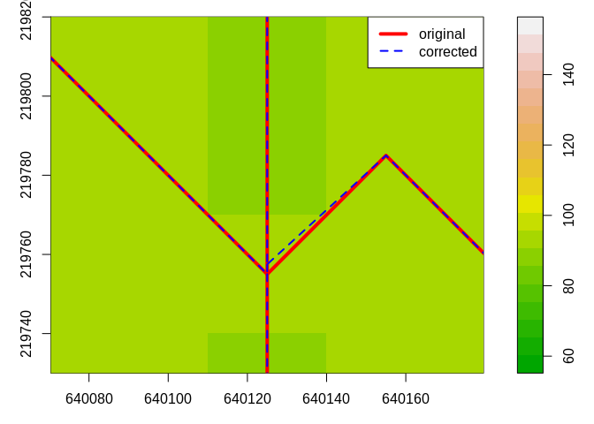

---
output:
  html_document:
    keep_md: yes
---

<!-- README.md is generated from README.Rmd. Please edit that file -->

openSTARS
=============


## Introduction
`openSTARS` is an open source implementation of the STARS toolbox (Peterson & Ver Hoef, 2014) using R and GRASS GIS.
It prepares the .ssn object needed for the SSN package.
A digital elevation model (DEM) is used to derive stream networks (in contrast to STARS that can clean an existing stream network). The reason for this is that existing stream networks (e.g. obtained as shape files) very often contain loops and dead ends that hinder building a valid topology for them.

For more information on STARS and SSN, see [their web page](http://www.fs.fed.us/rm/boise/AWAE/projects/SpatialStreamNetworks.shtml).

Peterson, E. E., & Ver Hoef, J. M. (2014). STARS: An ArcGIS Toolset Used to Calculate the Spatial Information Needed to Fit Spatial Statistical Models to Stream Network Data. J Stat Softw, 56(2), 1–17.

## Installation and loading
A functional installation of [GRASS GIS (>=7.0)](https://grass.osgeo.org/#) with installed add-ons [r.stream.basins](https://grass.osgeo.org/grass78/manuals/addons/r.stream.basins.html), [r.stream.distance](https://grass.osgeo.org/grass78/manuals/addons/r.stream.distance.html), [r.stream.order](https://grass.osgeo.org/grass78/manuals/addons/r.stream.order.html) and 
[r.hydrodem](https://grass.osgeo.org/grass78/manuals/addons/r.hydrodem.html) is needed.
These add-ons can be installed from within GRASS using the console and g.extension or in the GUI under 'Settings'/'Addons extensions'/'Install extensions from add-ons' under 'raster'.

Installation from CRAN repository:

```r
install.packages("openSTARS")
library("openSTARS")
```

For the lastest development version of openSTARS on GitHub (carefull, might be experimental):

```r
# install.packages("devtools")
devtools::install_github("MiKatt/openSTARS", ref = "dev")
library("openSTARS")
```

## Step by step usage

### Initiate an ephemeral GRASS session
First, a GRASS session must be initiated:

```r
library(openSTARS)
initGRASS(gisBase = "/usr/lib/grass74/",
          home = tempdir(),
          override = TRUE)
```

Alternatively, the path to a specific GRASS database directory and a Location name can be provided.

```r
library(openSTARS)
initGRASS(gisBase = "/usr/lib/grass74/",
          home = tempdir(),
          gisDbase = file.path(tempdir(),"GRASSDB"),
          location = "test_openSTARS",
          remove_GISRC = T)
#> gisdbase    /tmp/Rtmp2NLERx/GRASSDB 
#> location    test_openSTARS 
#> mapset      file2ea6303e3a51 
#> rows        1 
#> columns     1 
#> north       1 
#> south       0 
#> west        0 
#> east        1 
#> nsres       1 
#> ewres       1 
#> projection  NA
```

On Windows, this might look like this:

```r
library(openSTARS)
initGRASS(gisBase = "c:/Program Files/GRASS GIS 7.4.0", 
          home = tempdir(),
          location = "test_openSTARS",
          remove_GISRC = T)
```


### Setup GRASS and load data into GRASS
The path to the digital elevation model (DEM) and the observation sites must be
provided. Additionally, the path to a stream network, which can be burnt into the
DEM before extracting the streams, can be given.

First, `setup_grass_environment` prepares the GRASS environment by setting the projection and the region to the extent of the DEM. If the DEM does not contain projection infromation, an EPSG code can be provided. However, this must be the correct one for the DEM as no projection of raster data is performed here.
 
**Update**
Please use data in a metric coordinate reference system (CRS) appropriate for the study region (i.e. no long/lat CRS). Otherwise particularly the network correction on 'correct_colplex_confluences' might not work proberly. Suggestions for CRS can e.g. be found here http://epsg.io/.

For more information on the concept of GRASS Locations, Mapsets etc. see the [GRASS GIS Quickstart](https://grass.osgeo.org/grass78/manuals/helptext.html).


```r
dem_path <- system.file("extdata", "nc", "elev_ned_30m.tif", package = "openSTARS")

setup_grass_environment(dem = dem_path)
#> Setting up GRASS Environment ...

gmeta()
#> gisdbase    /tmp/Rtmp2NLERx/GRASSDB 
#> location    test_openSTARS 
#> mapset      PERMANENT 
#> rows        450 
#> columns     500 
#> north       228500 
#> south       215000 
#> west        630000 
#> east        645000 
#> nsres       30 
#> ewres       30 
#> projection  +proj=lcc +lat_1=36.16666666666666 +lat_2=34.33333333333334
#> +lat_0=33.75 +lon_0=-79 +x_0=609601.22 +y_0=0 +no_defs +a=6378137
#> +rf=298.257222101 +towgs84=0.000,0.000,0.000 +to_meter=1
```

Then, use `import_data` to import all data into GRASS (DEM, observation sites and other optional data). Optional data includes a stream network to burn into the DEM (see `derive_streams`), prediction sites if they have been already created with a different program (alternatively, prediction sites can be created using `calc_prediction_sites`), and raster and vector maps of potential predictor variables for the SSN model that can later be intersected with the catchments of the sites (`calc_attributes_edges` and `calc_attributes_sites_approx`, or `calc_attributes_sites_exact`). 

Note that vector data is reprojected on the fly in this import, while raster data is not as it should be done manually (due to the changes this might cause to the resolution etc.). It can be checked before the import if the current region (as defined by the dem) and other raster maps have the same projection. If this is not the case, they should be reprojected before, so that the dem and all raster files have identical projections. Please note that providing all data including vector data in the same coordinate reference system (CRS) is best to avoid errors during on the fly import.


```r
preds_r_path <- system.file("extdata", "nc", "landuse_r.tif", package = "openSTARS")
check_projection(preds_r_path)
#>       GRASS project                landuse_r.tif                comp1 
#>  [1,] "+proj=lcc"                  "+proj=lcc"                  "TRUE"
#>  [2,] "+lat_1=36.16666666666666"   "+lat_1=36.16666666666666"   "TRUE"
#>  [3,] "+lat_2=34.33333333333334"   "+lat_2=34.33333333333334"   "TRUE"
#>  [4,] "+lat_0=33.75"               "+lat_0=33.75"               "TRUE"
#>  [5,] "+lon_0=-79"                 "+lon_0=-79"                 "TRUE"
#>  [6,] "+x_0=609601.22"             "+x_0=609601.22"             "TRUE"
#>  [7,] "+y_0=0"                     "+y_0=0"                     "TRUE"
#>  [8,] "+no_defs"                   "+no_defs"                   "TRUE"
#>  [9,] "+a=6378137"                 "+a=6378137"                 "TRUE"
#> [10,] "+rf=298.257222101"          "+rf=298.257222101"          "TRUE"
#> [11,] "+towgs84=0.000,0.000,0.000" "+towgs84=0.000,0.000,0.000" "TRUE"
#> [12,] "+to_meter=1"                "+to_meter=1"                "TRUE"
```


```r
# the observation sites
sites_path <- system.file("extdata", "nc", "sites_nc.shp", package = "openSTARS")
# potential predictor in raster format
preds_r_path <- system.file("extdata", "nc", "landuse_r.tif", package = "openSTARS")
# potential predictors in vector format
preds_v_path <- c(system.file("extdata", "nc", "geology.shp", package = "openSTARS"),
                  system.file("extdata", "nc", "pointsources.shp", package = "openSTARS"))
# existing stream network
streams_path <- system.file("extdata", "nc", "streams.shp", package = "openSTARS")

import_data(dem = dem_path, sites = sites_path, streams = streams_path, 
            predictor_vector = preds_v_path, predictor_v_names = c("geology", "psources"), 
            predictor_raster = preds_r_path)
#> Loading DEM into GRASS as 'dem' ...
#> Loading sites into GRASS as 'sites_o' ...
#> Loading raster predictor variables into GRASS as 'landuse_r' ...
#> Loading vector predictor variables into GRASS as 'geology', 'psources' ...
#> Loading streams into GRASS as 'streams_o'  ...
```

The DEM is loaded into the GRASS database as a raster map named `dem`, the sites as a vector map named `sites_o` and the (optional) stream network as a vector map named `streams_o`. Predictor sites are stored under their base file name, potential predictors either using their base file names or the ones provided in 'predictor_r_names' and 'predictor_v_names', respectively.

The data looks like this:


```r
library(sp)
dem <- readRAST("dem", ignore.stderr = TRUE)
sites <- readVECT("sites_o", ignore.stderr = TRUE)
psources <- readVECT("psources", ignore.stderr = TRUE)
lu <- readRAST("landuse_r", ignore.stderr = TRUE)
plot(dem, col = gray(seq(0,1,length.out=20)))
cols <- colorRampPalette(c("blue", "red"))(length(sites$value))[rank(sites$value)]
points(sites, pch = 16, col = cols)
points(psources, pch = 19, col = 1, cex = 1.7)
legend(x = par("usr")[2]*0.991, y = par("usr")[4]*0.999, pch = c(16, 16, 19), ncol = 1, col = c(range(cols),1), legend = c(paste("value at sites:", c(range(sites$value))), "point sources"))
```

<!-- -->

```r
col <- adjustcolor(c("orange", "yellow",  "green", "greenyellow", "green3","blue", "brown"), alpha.f = 1)
image(lu["landuse_r"], col = col)
legend("right", col = col, pch = 15, legend = as.factor(sort(unique(lu$landuse_r))), 
       title = "landuse")
```

<!-- -->

### Derive streams from DEM
Next, the streams must be derived from the DEM.

```r
derive_streams()
```
An existing stream network (if provided to `import_data` before) can be burnt into the DEM to force the streams derived from the DEM to mapped ones. It is not possible to use a given stream network directly but it has to be derived from the DEM because otherwise it lacks topological information needed in the consecutive steps. Additional specifications on how the streams shall be created can be provided (see `?derive_streams` and the GRASS function [r.stream.extract](https://grass.osgeo.org/grass78/manuals/r.stream.extract.html) for details).


```r
derive_streams(accum_threshold = 100, condition = T, clean = TRUE, burn = 10)
#> Conditioning DEM ...
#> Burning streams into DEM ...
#> Deriving streams from DEM ...
#> Calculating stream topology ...
#> Derived streams saved as 'streams_v'.
```


```r
dem <- readRAST("dem", ignore.stderr = TRUE)
streams <- readVECT("streams_v", ignore.stderr = TRUE)
plot(dem, col = terrain.colors(20))
lines(streams, col = "blue")
cols <- colorRampPalette(c("blue", "red"))(length(sites$value))[rank(sites$value)]
points(sites, pch = 16, col = cols)
```

<!-- -->

### Check and correct the network
Next, the stream network should be checked if there are stream segments with more than two inflows. These must be corrected because the .ssn object must not have such complex confluences. In the nc data set provided, there will be complex confluences only if accum_threshold is small (e.g. 150; note that this will take long to run and use a lot of memory).


```r
cp <- check_compl_confluences()

if (cp)
  correct_compl_confluences()
```


```r
dem <- readRAST('dem', ignore.stderr = TRUE)
#> Creating BIL support files...
#> Exporting raster as floating values (bytes=4)
#>    0%   3%   6%   9%  12%  15%  18%  21%  24%  27%  30%  33%  36%  39%  42%  45%  48%  51%  54%  57%  60%  63%  66%  69%  72%  75%  78%  81%  84%  87%  90%  93%  96%  99% 100%
streams <- readVECT('streams_v', ignore.stderr = TRUE)
streams_orig <- readVECT('streams_v_o3', ignore.stderr = TRUE)
# zoom to a relevant part of the dem
plot(dem, col = terrain.colors(20), axes = TRUE,
     xlim = c(640080,640170), ylim = c(219730,219820))
lines(streams_orig, col = 'red', lwd = 4)
lines(streams, col = 'blue', lty = 2, lwd = 2)
legend("topright", col = c("red", "blue"), lty = c(1,2), lwd = c(4,2),
       legend = c("original", "corrected"))
```

<!-- -->


<!-- An example of a complex junction and the correction would look like this: -->

<!--    -->

<!-- *Left* Original network with complex junction (i.e. three inflows to one outflow).  -->
<!-- *Right* Corrected network. Arrows indicate flow direction. -->


The end node of one segment is moved a small fraction of the cell size upstream on a neighbouring segment. That segement is split into two parts at the new confluence. All features are corrected accordingly (cat, stream, length, prev_str01, prev_str02, next_str etc.). 

Other topological errors as mentioned for the ArcGIS toolbox STARS do not occur
if the stream network is derived from a DEM.

### Prepare edges
Now, information needed for the .ssn object can be derived for the streams and stored in a new vector map `edges`.


```r
calc_edges()
```


```r
edges <- readVECT("edges", ignore.stderr = TRUE)
head(edges@data, n = 4)
#>   cat cat_ stream prev_str01 prev_str02 next_str flow_accu changed netID rid
#> 1   1    1      1          0          0       67  147.6439       0    50   0
#> 2   2    2      2          0          0       67  363.1734       0    50   1
#> 3   3    3      3          0          0      216  914.0473       0    14   2
#> 4   4    4      4          0          0       68  238.7341       0    16   3
#>   OBJECTID  Length   upDist H2OArea rcaArea
#> 1        1  434.56 21136.97  0.2511  0.2511
#> 2        2  554.56 21256.97  0.3312  0.3312
#> 3        3 1059.41  2248.23  0.6093  0.6093
#> 4        4  501.84  3247.65  0.2205  0.2205
```

`edges` now holds the derived network plus attributes needed for the .ssn object

* network identifier (netID)
* reach identifier (rid)
* stream segment length (length)
* distance from the source (sourceDist)
* upstream distance, i.e. distance from the outlet of the network to the start (upstream node) of the stream segment (upDist)
* total catchment area (H2OArea)
* reach contributing area (rcaArea)

The additional fields hold information about the network: 'next_str' is the 'stream' this segment flows into, 'prev_str01' and 'prev_str02' are the two segments that flow into this segment.

### Prepare sites
Often, survey sites do not lay exactly on the stream network (due to GPS imprecision, stream representation as lines, derivation of streams from a DEM, etc.). To assign an exact position of the sites on the network they are moved to the closest stream segment (snapped) using the GRASS function
[v.distance](https://grass.osgeo.org/grass78/manuals/v.distance.html). Additionally, attributes needed for .ssn object are assigned: 


```r
calc_sites()
```


```r
sites <- readVECT("sites", ignore.stderr = TRUE)
head(sites@data, n = 4)
#>   cat site_id value str_edge     dist   NEAR_X   NEAR_Y locID pid netID rid
#> 1   1       1     1       65 85.04240 631046.1 226074.1     1   1    50  64
#> 2   2       4     1      174 47.80371 632011.9 225175.7     2   2    50 173
#> 3   3       5     1       67 29.83919 631203.4 224771.5     3   3    50  66
#> 4   4       7     1      175 31.22663 631787.3 224883.8     4   4    50 174
#>     upDist distalong     ratio
#> 1 21252.95  147.9922 0.1536049
#> 2 19793.00  114.8528 0.7124438
#> 3 20437.56  264.8528 0.4950953
#> 4 19710.99  104.7310 0.6591677
```

`sites` now holds the corrected sites plus attributes needed for the .ssn object

* point identifier (pid)
* location identifier (locID) 
* network identifier (netID)
* reach identifier of the edge segment the point lies on (rid)
* upstream distance (upDist), i.e. the distance to the network outlet calculated using [r.stream.distance](https://grass.osgeo.org/grass78/manuals/addons/r.stream.distance.html).
* distance ratio, i.e. the ratio of the distance from the outflow of the edge to the point along the edge and the total length of the edge segment (distRatio).

Additional fields hold information on the snapping: distance of the original site to the closest edge ('dist'), i.e. how far the point was moved, and the new x and y coordinates ('xm', 'ym'). The filed 'cat_edge' gives the 'cat' of the stream segment the point lies on. It is used to identify the edge the point lies on to extract the 'rid'.

It is possible to give a maximum distance a point is allowed to be moved ('maxdist'). Points farther away from any stream are deleted.


```r
calc_sites(maxdist = 100)
```


```r
dem <- readRAST("dem", ignore.stderr = TRUE)
#> Creating BIL support files...
#> Exporting raster as floating values (bytes=4)
#>    0%   3%   6%   9%  12%  15%  18%  21%  24%  27%  30%  33%  36%  39%  42%  45%  48%  51%  54%  57%  60%  63%  66%  69%  72%  75%  78%  81%  84%  87%  90%  93%  96%  99% 100%
sites <- readVECT("sites", ignore.stderr = TRUE)
sites_orig <- readVECT("sites_o", ignore.stderr = TRUE)
edges <- readVECT("edges", ignore.stderr = TRUE)
plot(dem, col = terrain.colors(20))
lines(edges, col = "blue")
points(sites_orig, pch = 20, col = "black")
points(sites, pch = 21, cex=0.75, bg = "grey")
legend("topright", y = par("usr")[3]*1.01, col = 1, pt.bg = "grey", pch = c(21, 19), legend = c("snapped sites", "original sites"), ncol = 2)
```

<!-- -->

### Prepare prediction sites
Prediction sites can be created along the streams. Either the distance between the sites must be provided (`dist`) or the approximate number of sites that shall be created (`nsites`). Additionally, the creation can be restricted to certain networks (`netIDs`). The sites will be assigned regularly on the stream network. If prediction sites with specifec coordinates are needed, they should be created manually.

Similar as for the observation sites, attributes needed for .ssn object are assigned: 

* point identifier (pid)
* location identifier (locID) 
* network identifier (netID)
* reach identifier of the edge segment the point lies on (rid)
* upstream distance (upDist), i.e. the distance to the network outlet calculated using [r.stream.distance](https://grass.osgeo.org/grass78/manuals/addons/r.stream.distance.html).
* distance ratio, i.e. the ratio of the distance from the outflow of the edge to the point along the edge and the total length of the edge segment (distRatio).

The filed 'cat_edge' gives the 'cat' of the stream segment the point lies on (equivalent to 'rid').


```r
calc_prediction_sites(predictions = "preds", nsites = 100, netIDs = 50 )
```


```r
dem <- readRAST("dem", ignore.stderr = TRUE)
#> Creating BIL support files...
#> Exporting raster as floating values (bytes=4)
#>    0%   3%   6%   9%  12%  15%  18%  21%  24%  27%  30%  33%  36%  39%  42%  45%  48%  51%  54%  57%  60%  63%  66%  69%  72%  75%  78%  81%  84%  87%  90%  93%  96%  99% 100%
sites <- readVECT("sites", ignore.stderr = TRUE)
pred_sites <- readVECT("preds", ignore.stderr = TRUE)
edges <- readVECT("edges", ignore.stderr = TRUE)
plot(dem, col = terrain.colors(20))
lines(edges, col = "blue")
points(sites, pch = 21, cex=0.75, bg = "grey")
points(pred_sites, pch = 21, cex=0.75, bg = "royalblue")
legend("topright", ncol = 2, pt.bg = c("grey","royalblue"), pch = 21, legend = c("(snapped) observation sites","prediction sites"))
```

<!-- -->

```r
head(pred_sites@data, n = 5)
#>   cat str_edge         dist pid rid distalong      ratio locID netID   upDist
#> 1   1        6 0.000000e+00   1   5       231 0.48319835     1    50 21616.92
#> 2   2       14 2.910383e-11   2  13       229 0.20955438     2    50 18528.19
#> 3   3       26 0.000000e+00   3  25       793 0.06309074     3    50 16984.48
#> 4   4       34 0.000000e+00   4  33       385 0.29652098     4    50 15439.99
#> 5   5       42 0.000000e+00   5  41       532 0.19653240     5    50 15439.97
#>     NEAR_X   NEAR_Y
#> 1 630885.0 226233.7
#> 2 633426.7 225956.7
#> 3 633727.2 223827.2
#> 4 634545.1 222785.0
#> 5 635115.0 225645.1
```

If prediction sites were prepared before in a different software and were loaded with 'import_data' they should be treated in the same way as the observation sites:


```r
calc_sites(pred_site = name_of_prediction_sites)
```
### Calculate attributes from raster and vector maps
Attributes (i.e. predictor variables for the .ssn object) can be calculated for observation and prediction sites. There are two ways to calculates attributes: 

1. approximately as described in Peterson & Ver Hoef, 2014: STARS: An ARCGIS Toolset Used to Calculate the Spatial Information Needed to Fit Spatial Statistical Models to Stream Network Data. J. Stat. Softw., 56 (2).
2. exactly by intersecting the catchment of each point with raster maps;

For the approximate calculation, first attributes must be intersected with the sub-catchments of the stream segments and then they are assigned to each site based on the distance ratio of the point. Note that the sub-catchment area 'H2OArea' for each stream segment is calculated automatically in calc_edges.


```r
# calculate slope from DEM as an example attribute
execGRASS("r.slope.aspect", flags = c("overwrite","quiet"),
          parameters = list(
            elevation = "dem",
            slope = "slope"
          ))
# calculate average slope per sub-catchment of each stream segment using raster data
calc_attributes_edges(input_raster = c("slope", "landuse_r"), stat_rast = c("mean", "percent"),
                      attr_name_rast = c("avSlo","lu"),
                      round_dig = 4)
#calculate approx. catchment area, average slope per catchment and percentage of land use class of each site
calc_attributes_sites_approx(sites_map = "sites", 
                             input_attr_name = c("avSlo",paste0("lup_",1:7)),
                             output_attr_name = c("avSloA",paste0("luA", 1:7)),
                             stat = c("mean", rep("percent", 7)))
sites <- readVECT("sites", ignore.stderr = TRUE)
head(sites@data, n = 5)
#>   cat site_id value str_edge     dist   NEAR_X   NEAR_Y locID pid netID rid
#> 1   1       1     1       65 85.04240 631046.1 226074.1     1   1    50  64
#> 2   2       4     1      174 47.80371 632011.9 225175.7     2   2    50 173
#> 3   3       5     1       67 29.83919 631203.4 224771.5     3   3    50  66
#> 4   4       7     1      175 31.22663 631787.3 224883.8     4   4    50 174
#> 5   5       8     1      239 16.18538 632259.0 224793.9     5   5    50 238
#>     upDist distalong     ratio H2OAreaA   avSloA      luA1 luA2       luA3
#> 1 21252.95  147.9922 0.1536049     0.61 2.937966 0.3613933    0 0.00000000
#> 2 19793.00  114.8528 0.7124438     2.06 3.329566 0.1688907    0 0.05838198
#> 3 20437.56  264.8528 0.4950953     0.73 2.376832 0.5667011    0 0.09617373
#> 4 19710.99  104.7310 0.6591677     1.28 2.680713 0.4892905    0 0.06224900
#> 5 19146.19  362.2495 0.4125906     3.65 3.101892 0.2736008    0 0.05596925
#>          luA4      luA5 luA6 luA7
#> 1 0.071117562 0.5674891    0    0
#> 2 0.044203503 0.7285238    0    0
#> 3 0.006204757 0.3309204    0    0
#> 4 0.024096386 0.4236948    0    0
#> 5 0.038674033 0.6315157    0    0
```

The exact calculation of attribute values for the total catchment of each point can take quite long (depending on the number of points): For each point, first the total catchment is delineated based on the DEM and then intersected with the map(s) provided. It must be decided on a case by case basis if the approximate calculation is good enough.


```r
# calculate exact catchment area, average slope per catchment and number of point sources of each site
calc_attributes_sites_exact(sites_map = "sites", 
                            input_raster = "slope",
                            stat_rast = "mean",
                            attr_name_rast = "avSloE", 
                            input_vector = "psources",
                            stat_vect = "count",
                            attr_name_vect = "nps",
                            round_dig = 4)
sites <- readVECT("sites", ignore.stderr = TRUE)
head(sites@data, n = 5)
#>   cat site_id value str_edge     dist   NEAR_X   NEAR_Y locID pid netID rid
#> 1   1       1     1       65 85.04240 631046.1 226074.1     1   1    50  64
#> 2   2       4     1      174 47.80371 632011.9 225175.7     2   2    50 173
#> 3   3       5     1       67 29.83919 631203.4 224771.5     3   3    50  66
#> 4   4       7     1      175 31.22663 631787.3 224883.8     4   4    50 174
#> 5   5       8     1      239 16.18538 632259.0 224793.9     5   5    50 238
#>     upDist distalong     ratio H2OAreaA   avSloA      luA1 luA2       luA3
#> 1 21252.95  147.9922 0.1536049     0.61 2.937966 0.3613933    0 0.00000000
#> 2 19793.00  114.8528 0.7124438     2.06 3.329566 0.1688907    0 0.05838198
#> 3 20437.56  264.8528 0.4950953     0.73 2.376832 0.5667011    0 0.09617373
#> 4 19710.99  104.7310 0.6591677     1.28 2.680713 0.4892905    0 0.06224900
#> 5 19146.19  362.2495 0.4125906     3.65 3.101892 0.2736008    0 0.05596925
#>          luA4      luA5 luA6 luA7 H2OArea avSloE nps
#> 1 0.071117562 0.5674891    0    0  0.6201 2.9380   0
#> 2 0.044203503 0.7285238    0    0  2.1105 3.2877   0
#> 3 0.006204757 0.3309204    0    0  0.6696 2.3850   0
#> 4 0.024096386 0.4236948    0    0  1.2726 2.5608   0
#> 5 0.038674033 0.6315157    0    0  3.7116 3.0860   0
```
In both alternatives, the catchment area for each site is calculated automatically ('H2OAreaA' for `calc_attributes_sites_appox` and 'H2OArea' for `calc_attributes_sites_exact`).

If predictions are to be made in a later step, the same attributes must be calculated for the prediction sites.

### Write all files to an ssn folder
All files needed (edges, sites and optionally prediction sites) are written to the file path provided and can then be read in by the SSN package.


```r
ssn_dir <- file.path(tempdir(), 'nc.ssn')
export_ssn(ssn_dir)
list.files(ssn_dir)
#>  [1] "edges.dbf"   "edges.prj"   "edges.shp"   "edges.shx"   "netID1.dat" 
#>  [6] "netID10.dat" "netID11.dat" "netID12.dat" "netID13.dat" "netID14.dat"
#> [11] "netID15.dat" "netID16.dat" "netID17.dat" "netID18.dat" "netID19.dat"
#> [16] "netID2.dat"  "netID20.dat" "netID21.dat" "netID22.dat" "netID23.dat"
#> [21] "netID24.dat" "netID25.dat" "netID26.dat" "netID27.dat" "netID28.dat"
#> [26] "netID29.dat" "netID3.dat"  "netID30.dat" "netID31.dat" "netID32.dat"
#> [31] "netID33.dat" "netID34.dat" "netID35.dat" "netID36.dat" "netID37.dat"
#> [36] "netID38.dat" "netID39.dat" "netID4.dat"  "netID40.dat" "netID41.dat"
#> [41] "netID42.dat" "netID43.dat" "netID44.dat" "netID45.dat" "netID46.dat"
#> [46] "netID47.dat" "netID48.dat" "netID49.dat" "netID5.dat"  "netID50.dat"
#> [51] "netID51.dat" "netID52.dat" "netID53.dat" "netID6.dat"  "netID7.dat" 
#> [56] "netID8.dat"  "netID9.dat"  "sites.dbf"   "sites.prj"   "sites.shp"  
#> [61] "sites.shx"
```


#### Try with SSN package

```r
library(SSN)
# import
ssn_obj <- importSSN(ssn_dir, o.write = TRUE)
plot(ssn_obj, 'value')
```

<!-- -->

```r

# Create Distance Matrix
createDistMat(ssn_obj, o.write = TRUE)
dmats <- getStreamDistMat(ssn_obj)

ssn_obj.Torg <- Torgegram(ssn_obj, "value", nlag = 20, maxlag = 15000)
plot(ssn_obj.Torg)
```

<!-- -->

```r

names(ssn_obj@data)
#>  [1] "cat"       "cat_"      "stream"    "flow_accu" "changed"   "netID"    
#>  [7] "rid"       "OBJECTID"  "Length"    "upDist"    "H2OArea"   "rcaArea"  
#> [13] "avSlo_e"   "avSlo_c"   "lup_1_e"   "lup_1_c"   "lup_2_e"   "lup_2_c"  
#> [19] "lup_3_e"   "lup_3_c"   "lup_4_e"   "lup_4_c"   "lup_5_e"   "lup_5_c"  
#> [25] "lup_6_e"   "lup_6_c"   "lup_7_e"   "lup_7_c"
names(ssn_obj)
#> $Obs
#>  [1] "cat"       "site_id"   "value"     "str_edge"  "dist"      "NEAR_X"   
#>  [7] "NEAR_Y"    "locID"     "pid"       "netID"     "rid"       "upDist"   
#> [13] "distalong" "ratio"     "H2OAreaA"  "avSloA"    "luA1"      "luA2"     
#> [19] "luA3"      "luA4"      "luA5"      "luA6"      "luA7"      "H2OArea"  
#> [25] "avSloE"    "nps"
ssn_obj <- additive.function(ssn_obj, "H2OArea", "computed.afv")

# non-spatial model
ssn_obj.glmssn0 <- glmssn(value ~ upDist, ssn.object = ssn_obj,
                            CorModels = NULL)
summary(ssn_obj.glmssn0)
#> 
#> Call:
#> glmssn(formula = value ~ upDist, ssn.object = ssn_obj, CorModels = NULL)
#> 
#> Residuals:
#>     Min      1Q  Median      3Q     Max 
#> -4.8739 -2.4234 -0.1302  2.3307  5.2645 
#> 
#> Coefficients:
#>               Estimate Std. Error t value Pr(>|t|)    
#> (Intercept)  6.513e+00  8.208e-01   7.935  < 2e-16 ***
#> upDist      -2.038e-04  7.621e-05  -2.674  0.00971 ** 
#> ---
#> Signif. codes:  0 '***' 0.001 '**' 0.01 '*' 0.05 '.' 0.1 ' ' 1
#> 
#> Covariance Parameters:
#>  Covariance.Model Parameter Estimate
#>            Nugget   parsill     8.64
#> 
#> Residual standard error: 2.938893
#> Generalized R-squared: 0.1097863
# same as
summary(lm(value ~ upDist, getSSNdata.frame(ssn_obj)))
#> 
#> Call:
#> lm(formula = value ~ upDist, data = getSSNdata.frame(ssn_obj))
#> 
#> Residuals:
#>     Min      1Q  Median      3Q     Max 
#> -4.8739 -2.4234 -0.1302  2.3307  5.2645 
#> 
#> Coefficients:
#>               Estimate Std. Error t value Pr(>|t|)    
#> (Intercept)  6.513e+00  8.208e-01   7.935 7.86e-11 ***
#> upDist      -2.038e-04  7.621e-05  -2.674  0.00971 ** 
#> ---
#> Signif. codes:  0 '***' 0.001 '**' 0.01 '*' 0.05 '.' 0.1 ' ' 1
#> 
#> Residual standard error: 2.939 on 58 degrees of freedom
#> Multiple R-squared:  0.1098,	Adjusted R-squared:  0.09444 
#> F-statistic: 7.153 on 1 and 58 DF,  p-value: 0.009708


# # # spatial model
ssn_obj.glmssn1 <- glmssn(value ~ upDist , ssn.object = ssn_obj,
                            CorModels = c("Exponential.taildown", "Exponential.tailup"),
                          addfunccol = "computed.afv")
summary(ssn_obj.glmssn1)
#> 
#> Call:
#> glmssn(formula = value ~ upDist, ssn.object = ssn_obj, CorModels = c("Exponential.taildown", 
#>     "Exponential.tailup"), addfunccol = "computed.afv")
#> 
#> Residuals:
#>     Min      1Q  Median      3Q     Max 
#> -5.0814 -2.4138 -0.1994  2.1732  5.2265 
#> 
#> Coefficients:
#>               Estimate Std. Error t value Pr(>|t|)    
#> (Intercept)  6.7919904  1.2350884   5.499   <2e-16 ***
#> upDist      -0.0002265  0.0001045  -2.167   0.0344 *  
#> ---
#> Signif. codes:  0 '***' 0.001 '**' 0.01 '*' 0.05 '.' 0.1 ' ' 1
#> 
#> Covariance Parameters:
#>      Covariance.Model Parameter   Estimate
#>    Exponential.tailup   parsill     9.9362
#>    Exponential.tailup     range 35341.4760
#>  Exponential.taildown   parsill     0.7490
#>  Exponential.taildown     range 92978.9076
#>                Nugget   parsill     0.0143
#> 
#> Residual standard error: 3.271005
#> Generalized R-squared: 0.07584866
varcomp(ssn_obj.glmssn1)
#>                VarComp  Proportion
#> 1    Covariates (R-sq) 0.075848663
#> 2   Exponential.tailup 0.858222919
#> 3 Exponential.taildown 0.064694757
#> 4               Nugget 0.001233662
```


### Contributors

+ [Mira Kattwinkel](https://github.com/MiKatt)
+ [Eduard Szöcs](https://github.com/EDiLD)

### Want to contribute?

Checkout our [contribution guide here](https://github.com/edild/openSTARS/blob/master/CONTRIBUTING.md).

### Meta

* Please [report any issues, bugs or feature requests](https://github.com/MiKatt/openSTARS/issues).
* License: MIT
