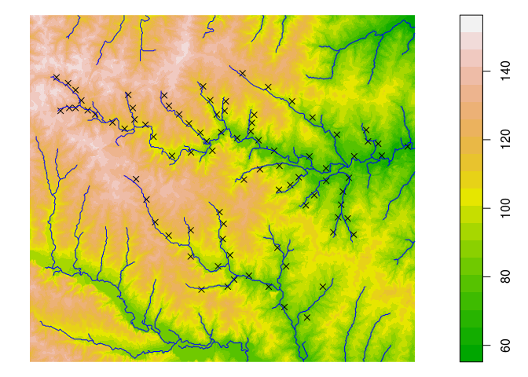

openSTARS
=============


[](https://travis-ci.org/edild/openSTARS)
[](https://github.com/edild/openSTARS/issues)

`openSTARS` is an open source implementation of the STARS toolbox (Peterson & Ver Hoef, 2014) using R and GRASS GIS.
It prepares the .ssn object needed for the SSN package.
Currently a DEM is used to derive stream networks (in contrast to STARS, which can clean an existing stream network).

For more information on STARS and SSN, see [their webpage](http://www.fs.fed.us/rm/boise/AWAE/projects/SpatialStreamNetworks.shtml).

Peterson, E. E., & Ver Hoef, J. M. (2014). STARS: An ArcGIS Toolset Used to Calculate the Spatial Information Needed to Fit Spatial Statistical Models to Stream Network Data. J Stat Softw, 56(2), 1–17.


### Installation
A functional installation of [GRASS GIS (>=7.0)](https://grass.osgeo.org/#) with installed addons [r.stream.basins](https://grass.osgeo.org/grass70/manuals/addons/r.stream.basins.html), [r.stream.distance](https://grass.osgeo.org/grass70/manuals/addons/r.stream.distance.html) and [r.stream.order](https://grass.osgeo.org/grass70/manuals/addons/r.stream.order.html) is needed.

The openSTARS package can be installed from github using


```r
install.packages("devtools")
devtools::install_github("edild/openSTARS")
library('openSTARS')
```


### Basic usage

Initiate a ephemeral GRASS session:

```r
library(openSTARS)
initGRASS(gisBase = "/usr/lib/grass70/",
          home = tempdir(),
          override = TRUE)
#> gisdbase    /tmp/RtmpNYk2IR 
#> location    file4f1047f5b40 
#> mapset      file4f10282f2f58 
#> rows        1 
#> columns     1 
#> north       1 
#> south       0 
#> west        0 
#> east        1 
#> nsres       1 
#> ewres       1 
#> projection  NA
```

Load DEM and sites into GRASS:


```r
dem_path <- system.file("extdata", "nc", "elev_ned_30m.tif", package = "openSTARS")
sites_path <- system.file("extdata", "nc", "sites_nc.shp", package = "openSTARS")

import_data(dem = dem_path, sites = sites_path)
#> WARNING: Over-riding projection check
#> WARNING: Raster map <dem> already exists and will be overwritten

gmeta()
#> gisdbase    /tmp/RtmpNYk2IR 
#> location    file4f1047f5b40 
#> mapset      PERMANENT 
#> rows        450 
#> columns     500 
#> north       228500 
#> south       215000 
#> west        630000 
#> east        645000 
#> nsres       30 
#> ewres       30 
#> projection  +proj=lcc +lat_1=36.16666666666666 +lat_2=34.33333333333334
#> +lat_0=33.75 +lon_0=-79 +x_0=609601.22 +y_0=0 +no_defs +a=6378137
#> +rf=298.257222101 +towgs84=0.000,0.000,0.000 +to_meter=1
```

The dem is loaded as raster names `dem`, the sites as vector named `sites_o`.
Here's how the data looks like:


```r
dem <- readRAST('dem', ignore.stderr = TRUE)
#> Creating BIL support files...
#> Exporting raster as floating values (bytes=4)
#>    0%   3%   6%   9%  12%  15%  18%  21%  24%  27%  30%  33%  36%  39%  42%  45%  48%  51%  54%  57%  60%  63%  66%  69%  72%  75%  78%  81%  84%  87%  90%  93%  96%  99% 100%
sites <- readVECT('sites_o', ignore.stderr = TRUE)
plot(dem, col = terrain.colors(20))
cols <- colorRampPalette(c("blue", 'red'))(length(sites$value))[rank(sites$value)]
points(sites, pch = 16, col = cols)
```

<!-- -->

Derive streams from DEM:

```r
derive_streams()

streams <- readVECT('streams_v', ignore.stderr = TRUE)
#> WARNING: 178 points found, but not requested to be exported. Verify 'type'
#>          parameter.
plot(dem, col = terrain.colors(20))
points(sites, pch = 16, col = cols)
lines(streams, col = 'blue')
```

<!-- -->

Prepare edges:


```r
calc_edges()
#> WARNING: 178 points found, but not requested to be exported. Verify 'type'
#>          parameter.
#> WARNING: Vector map <edges> already exists and will be overwritten
#> WARNING: Width for column stream_type set to 255 (was not specified by
#>          OGR), some strings may be truncated!
#> Finding nearest features...
#>  100%
#>    4%   9%  14%  19%  24%  29%  34%  39%  44%  49%  54%  59%  64%  69%  74%  79%  84%  89%  94%  99% 100%
#> Update vector attributes...
#>    0%   2%   4%   6%   8%  10%  12%  14%  16%  18%  20%  22%  24%  26%  28%  30%  32%  34%  36%  38%  40%  42%  44%  46%  48%  50%  52%  54%  56%  58%  60%  62%  64%  66%  68%  70%  72%  74%  76%  78%  80%  82%  84%  86%  88%  90%  92%  94%  96%  98% 100%
#> v.distance complete. 162 records updated.
#> Finding nearest features...
#>  100%
#>    4%   9%  14%  19%  24%  29%  34%  39%  44%  49%  54%  59%  64%  69%  74%  79%  84%  89%  94%  99% 100%
#> Update vector attributes...
#>    0%   2%   4%   6%   8%  10%  12%  14%  16%  18%  20%  22%  24%  26%  28%  30%  32%  34%  36%  38%  40%  42%  44%  46%  48%  50%  52%  54%  56%  58%  60%  62%  64%  66%  68%  70%  72%  74%  76%  78%  80%  82%  84%  86%  88%  90%  92%  94%  96%  98% 100%
#> 162 categories with more than 1 feature in vector map <streams_topo>
#> 1 categories - no nearest feature found
#> v.distance complete. 162 records updated.
#> Finding nearest features...
#>  100%
#>    4%   9%  14%  19%  24%  29%  34%  39%  44%  49%  54%  59%  64%  69%  74%  79%  84%  89%  94%  99% 100%
#> Update vector attributes...
#>    0%   2%   4%   6%   8%  10%  12%  14%  16%  18%  20%  22%  24%  26%  28%  30%  32%  34%  36%  38%  40%  42%  44%  46%  48%  50%  52%  54%  56%  58%  60%  62%  64%  66%  68%  70%  72%  74%  76%  78%  80%  82%  84%  86%  88%  90%  92%  94%  96%  98% 100%
#> 162 categories with more than 1 feature in vector map <streams_topo>
#> 1 categories - no nearest feature found
#> v.distance complete. 162 records updated.
#> Finding nearest features...
#>  100%
#>    4%   9%  14%  19%  24%  29%  34%  39%  44%  49%  54%  59%  64%  69%  74%  79%  84%  89%  94%  99% 100%
#> Update vector attributes...
#>    0%   2%   4%   6%   8%  10%  12%  14%  16%  18%  20%  22%  24%  26%  28%  30%  32%  34%  36%  38%  40%  42%  44%  46%  48%  50%  52%  54%  56%  58%  60%  62%  64%  66%  68%  70%  72%  74%  76%  78%  80%  82%  84%  86%  88%  90%  92%  94%  96%  98% 100%
#> v.distance complete. 162 records updated.
#> Finding nearest features...
#>  100%
#>    4%   9%  14%  19%  24%  29%  34%  39%  44%  49%  54%  59%  64%  69%  74%  79%  84%  89%  94%  99% 100%
#> Update vector attributes...
#>    0%   2%   4%   6%   8%  10%  12%  14%  16%  18%  20%  22%  24%  26%  28%  30%  32%  34%  36%  38%  40%  42%  44%  46%  48%  50%  52%  54%  56%  58%  60%  62%  64%  66%  68%  70%  72%  74%  76%  78%  80%  82%  84%  86%  88%  90%  92%  94%  96%  98% 100%
#> v.distance complete. 162 records updated.
#> WARNING: 178 points found, but not requested to be exported. Verify 'type'
#>          parameter.
#> WARNING: Vector map <edges> already exists and will be overwritten
#> WARNING: Width for column stream_type set to 255 (was not specified by
#>          OGR), some strings may be truncated!
#> WARNING: No data base element files found
```


```r
edges <- readVECT('edges', ignore.stderr = TRUE)
head(edges@data)
#>   cat stream_type type_code rid OBJECTID netID    upDist topo_dim
#> 1   1       start         0 114      114   162 1877.9394       26
#> 2   2       start         0 111      111   162 1268.5281       23
#> 3   3       start         0 115      115   162 1877.9394       26
#> 4   4       start         0  79       79   151 6824.7727        7
#> 5   5       start         0   8        8     5 2687.0563        1
#> 6   6       start         0 106      106   162  204.8528       18
#>   H2OAreaKm2 rcaAreaKm2
#> 1     246.15     246.15
#> 2     106.74     106.74
#> 3     134.73     134.73
#> 4     552.33     552.33
#> 5     283.05     283.05
#> 6     310.41     310.41
```

`edges` now holds the derived network plus attributes needed for SSN (segment id, network id, upstream distance, watershed area, river contributing area, toplogical dimension)


Prepare sites:


### Contributors

+ [Eduard Szöcs](https://github.com/EDiLD)

### Want to contribute?

Checkout our [contribution guide here](https://github.com/edild/openSTARS/blob/master/CONTRIBUTING.md).

### Meta

* Please [report any issues, bugs or feature requests](https://github.com/edild/openSTARS/issues).
* License: MIT
