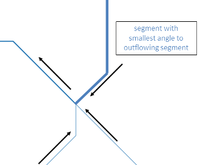
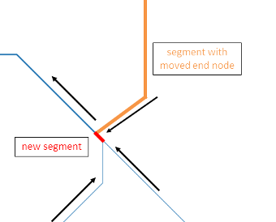

---
output:
  html_document:
    keep_md: yes
---

<!-- README.md is generated from README.Rmd. Please edit that file -->

openSTARS
=============


## Introduction
`openSTARS` is an open source implementation of the STARS toolbox (Peterson & Ver Hoef, 2014) using R and GRASS GIS.
It prepares the .ssn object needed for the SSN package.
A digital elevation model (DEM) is used to derive stream networks (in contrast to STARS that can clean an existing stream network). The reason for this is that existing stream networks (e.g. obtained as shape files) very often contain loops and dead ends that hinder building a valid topology for them.

For more information on STARS and SSN, see [their web page](http://www.fs.fed.us/rm/boise/AWAE/projects/SpatialStreamNetworks.shtml).

Peterson, E. E., & Ver Hoef, J. M. (2014). STARS: An ArcGIS Toolset Used to Calculate the Spatial Information Needed to Fit Spatial Statistical Models to Stream Network Data. J Stat Softw, 56(2), 1–17.

## Installation and loading
A functional installation of [GRASS GIS (>=7.0)](https://grass.osgeo.org/#) with installed add-ons [r.stream.basins](https://grass.osgeo.org/grass70/manuals/addons/r.stream.basins.html), [r.stream.distance](https://grass.osgeo.org/grass70/manuals/addons/r.stream.distance.html), [r.stream.order](https://grass.osgeo.org/grass70/manuals/addons/r.stream.order.html) and 
[r.hydrodem](https://grass.osgeo.org/grass70/manuals/addons/r.hydrodem.html) is needed.
These add-ons can be installed from within GRASS using the console and g.extension or in the GUI under 'Settings'/'Addons extensions'/'Install extensions from add-ons' under 'raster'.

Installation from CRAN repository:

```r
install.packages("openSTARS")
library("openSTARS")
```

For the lastest github version of openSTARS (carefull, might be experimental):

```r
# install.packages("devtools")
devtools::install_github("MiKatt/openSTARS")
library("openSTARS")
```

## Basic usage

### Initiate an ephemeral GRASS session
First, a GRASS session must be initiated:

```r
library(openSTARS)
initGRASS(gisBase = "/usr/lib/grass74/",
          home = tempdir(),
          override = TRUE)
#> gisdbase    /tmp/RtmpJ17uXr 
#> location    file5d2536a4f3a0 
#> mapset      file5d2515b1ac6e 
#> rows        1 
#> columns     1 
#> north       1 
#> south       0 
#> west        0 
#> east        1 
#> nsres       1 
#> ewres       1 
#> projection  NA
```

Alternatively, the path to a specific GRASS database directory and a Location name can be provided.

```r
library(openSTARS)
initGRASS(gisBase = "/usr/lib/grass74/",
          home = tempdir(),
          gisDbase = "./GRASSDB",
          location = "test_openSTARS",
          remove_GISRC = T,
          override = TRUE)
```

On Windows, this might look like this:

```r
library(openSTARS)
initGRASS(gisBase = "c:/Program Files/GRASS FUS 7.4.0",
          home = tempdir(),
          gisDbase = "./GRASSDB",
          location = "test_openSTARS",
          remove_GISRC = T,
          override = TRUE)
```


### Setup GRASS and load data into GRASS
The path to the digital elevation model (DEM) and the observation sites must be
provided. Additionally, the path to a stream network, which can be burnt into the
DEM before extracting the streams, can be given.

First, `setup_grass_environment` prepares the GRASS environment by setting

 * the projection to that one of the observation sites or to an epsg code provided
 * the region to the extent of the DEM.
 
For more information on the concept of GRASS Locations, Mapsets etc. see the [GRASS GIS Quickstart](https://grass.osgeo.org/grass73/manuals/helptext.html).


```r
dem_path <- system.file("extdata", "nc", "elev_ned_30m.tif", package = "openSTARS")

setup_grass_environment(dem = dem_path)
#> Setting up GRASS Environment ...

gmeta()
#> gisdbase    /tmp/RtmpJ17uXr 
#> location    file5d2536a4f3a0 
#> mapset      PERMANENT 
#> rows        450 
#> columns     500 
#> north       228500 
#> south       215000 
#> west        630000 
#> east        645000 
#> nsres       30 
#> ewres       30 
#> projection  +proj=lcc +lat_1=36.16666666666666 +lat_2=34.33333333333334
#> +lat_0=33.75 +lon_0=-79 +x_0=609601.22 +y_0=0 +no_defs +a=6378137
#> +rf=298.257222101 +towgs84=0.000,0.000,0.000 +to_meter=1
```

Then, use `import_data` to import all data into GRASS (DEM, observations sites and other optional data). Optional data includes a stream network to burn into the DEM (see `derive_streams`), prediction sites if they have been already created with a different program (alternatively, prediction sites can be created using `calc_prediction_sites`), and raster and vector maps of potential predictor variables for the SSN model that can later be intersected with the catchments of the sites (`calc_attributes_edges` and `calc_attributes_sites_approx`, or `calc_attributes_sites_exact`).

```r
sites_path <- system.file("extdata", "nc", "sites_nc.shp", package = "openSTARS")
preds_path <- c(system.file("extdata", "nc", "landuse.shp", package = "openSTARS"),
                 system.file("extdata", "nc", "pointsources.shp", package = "openSTARS"))
import_data(dem = dem_path, sites = sites_path, predictor_vector = preds_path, predictor_v_names = c("landuse", "psources"))
#> Loading DEM into GRASS ...
#> Loading sites into GRASS as sites_o ...
#> Loading predictior varibales into GRASS as landuse, psources ...
#> No streams available, skipping.
```

The DEM is loaded into the GRASS database as a raster map named `dem`, the sites as a vector map named `sites_o` and the (optional) stream network as a vector map named `streams_o`. Predictor sites are stored under their base file name, potential predictors either using their base file names or the ones provided in 'predictor_r_names' and 'predictor_v_names', respectively.

Here's how the data looks like:


```r
dem <- readRAST("dem", ignore.stderr = TRUE)
sites <- readVECT("sites_o", ignore.stderr = TRUE)
psources <- readVECT("psources", ignore.stderr = TRUE)
plot(dem, col = terrain.colors(20))
cols <- colorRampPalette(c("blue", "red"))(length(sites$value))[rank(sites$value)]
points(sites, pch = 16, col = cols)
points(psources, pch = 19, col = 1, cex = 1.7)
legend(x = par("usr")[1]*1.002, y = par("usr")[3]*1.015, pch = c(16, 16, 19), ncol = 1, col = c(range(cols),1), legend = c(paste("value at sites:", c(range(sites$value))), "point sources"))
```

<!-- -->

### Derive streams from DEM
Next, the streams should be derived from the DEM.

```r
derive_streams()
#> Conditioning DEM ...
#> Deriving streams from DEM ...
#> Calculating stream topology ...
```
An existing stream network (if provided to `import_data` before) can be burnt into the DEM to force the streams derived from the DEM to the existing ones. Additionally, other specifications on how the streams shall be created can be provided (see `?derive_streams` and the GRASS function  [r.stream.extract](https://grass.osgeo.org/grass72/manuals/r.stream.extract.html) for details).


```r
derive_streams(burn = 10, accum_threshold = 1000)
```


```r
dem <- readRAST("dem", ignore.stderr = TRUE)
streams <- readVECT("streams_v", ignore.stderr = TRUE)
plot(dem, col = terrain.colors(20))
lines(streams, col = "blue")
cols <- colorRampPalette(c("blue", "red"))(length(sites$value))[rank(sites$value)]
points(sites, pch = 16, col = cols)
```

### Check and correct the network
Next, the stream network should be checked if there are stream segments with more than two inflows. This must be corrected because the .ssn object must not have such complex junctions. In the nc data set provided, there will be complex junctions only if accum_threshold is small.


```r
derive_streams(burn = 0, accum_threshold = 100)
cp <- check_compl_junctions()
if (cp)
  correct_compl_junctions()
```


```r
dem <- readRAST('dem', ignore.stderr = TRUE)
streams <- readVECT('streams_v', ignore.stderr = TRUE)
streams_orig <- readVECT('streams_v_o', ignore.stderr = TRUE)
# zoom to a relevant part of the dem
plot(dem, col = terrain.colors(20), axes = TRUE,
  xlim = c(640050,640200), ylim = c(219700,219850))
lines(streams_orig, col = 'red', lwd = 4)
lines(streams, col = 'blue', lty = 2, lwd = 2)
legend("topright", col = c("red", "blue"), lty = c(1,2), lwd = c(4,2),
  legend = c("original", "corrected"))
```

An example of a complex junction and the correction would look like this:

  

*Left* Original network with complex junction (i.e. three inflows to one outflow). 
*Right* Corrected network. Arrows indicate flow direction.

The end node of the inflowing segment with the smallest angle to the outflowing 
segment is moved 0.25 times the cell size of the DEM downstream. The outflowing
segment is split into tow parts at this new junction. All features are corrected
accordingly (cat, length, prev_str01, prev_str02, next_str etc.). Currently, this 
only works for three inflows to the same outflow but not more.

Other topological errors as mentioned for the ArcGIS toolbox STARS do not occur
if the stream network is derived from a DEM

### Prepare edges
Now, information needed for the .ssn object can be derived for the streams and stored in a new vector map `edges`.


```r
calc_edges()
```


```r
edges <- readVECT("edges", ignore.stderr = TRUE)
head(edges@data, n = 4)
```

`edges` now holds the derived network plus attributes needed for the .ssn object

* network identifier (netID)
* reach identifier (rid)
* stream segment length (length)
* distance from the source (sourceDist)
* upstream distance, i.e. distance from the outlet of the network to the start (upstream node) of the stream segment (upDist)
* total catchment area (H2OArea)
* reach contributing area (rcaArea)

The additional fields hold information about the network: 'next_str' is the 'stream' this segment flows into, 'prev_str01' and 'prev_str02' are the two segments that flow into this segment.

### Prepare sites
Often, survey sites do not lay exactly on the stream network (due to GPS imprecision, stream representation as lines, derivation of streams from a DEM, etc.). To assign an exact position of the sites on the network they are moved to the closest stream segment (snapped) using the GRASS function
[v.distance](https://grass.osgeo.org/grass72/manuals/v.distance.html). Additionally, attributes needed for .ssn object are assigned: 

```r
calc_sites()
```


```r
sites <- readVECT("sites", ignore.stderr = TRUE)
head(sites@data, n = 4)
```

* point identifier (pid)
* location identifier (locID) 
* network identifier (netID)
* reach identifier of the edge segment the point lies on (rid)
* upstream distance (upDist), i.e. the distance to the network outlet calculated using [r.stream.distance](https://grass.osgeo.org/grass70/manuals/addons/r.stream.distance.html).
* distance ratio, i.e. the ratio of the distance from the outflow of the edge to the point along the edge and the total length of the edge segment (distRatio).

Additional fields hold information on the snapping: distance of the original site to the closest edge (dist), i.e. how far the point was moved, and the new x and y coordinates (xm, ym). The filed 'cat_edge' gives the 'cat' of the stream segment the point lies on. It is used to identify the edge the point lies on to extract the 'rid'.


```r
dem <- readRAST("dem", ignore.stderr = TRUE)
sites <- readVECT("sites", ignore.stderr = TRUE)
sites_orig <- readVECT("sites_o", ignore.stderr = TRUE)
edges <- readVECT("edges", ignore.stderr = TRUE)
plot(dem, col = terrain.colors(20))
lines(edges, col = "blue")
points(sites_orig, pch = 20, col = "black")
points(sites, pch = 21, cex=0.75, bg = "grey")
legend(x = par("usr")[1]*1.002, y = par("usr")[3]*1.01, col = 1, pt.bg = "grey", pch = c(21, 19), legend = c("snapped sites", "original sites"))
```

### Prepare prediction sites
Prediction sites can be created along the streams. Either the distance between the sites must be provided (`dist`) or the approximate number of sites that shall be created (`nsites`). Additionally, the creation can be restricted to certain networks (`netIDs`).

Similar as for the observation sites, attributes needed for .ssn object are assigned: 

* point identifier (pid)
* location identifier (locID) 
* network identifier (netID)
* reach identifier of the edge segment the point lies on (rid)
* upstream distance (upDist), i.e. the distance to the network outlet calculated using [r.stream.distance](https://grass.osgeo.org/grass70/manuals/addons/r.stream.distance.html).
* distance ratio, i.e. the ratio of the distance from the outflow of the edge to the point along the edge and the total length of the edge segment (distRatio).

The filed 'cat_edge' gives the 'cat' of the stream segment the point lies on (equivalent to 'rid').


```r
calc_prediction_sites(predictions = "preds", nsites = 100, netIDs = 15 )
```


```r
dem <- readRAST("dem", ignore.stderr = TRUE)
sites <- readVECT("sites", ignore.stderr = TRUE)
pred_sites <- readVECT("preds", ignore.stderr = TRUE)
edges <- readVECT("edges", ignore.stderr = TRUE)
plot(dem, col = terrain.colors(20))
lines(edges, col = "blue")
points(sites, pch = 21, cex=0.75, bg = "grey")
points(pred_sites, pch = 21, cex=0.75, bg = "royalblue")
legend(x = par("usr")[1]*1.002, y = par("usr")[3]*1.01, pt.bg = c("grey","royalblue"), pch = 21, legend = c("(snapped) observation sites","prediction sites"))
head(pred_sites@data, n = 4)
```

### Calculate attributes from raster and vector maps
Attributes (i.e. predictor variables for the .ssn object) can be calculated for observation and prediction sites. There are two ways to calculates attributes: 

1. approximately as described in Peterson & Ver Hoef, 2014: STARS: An ARCGIS Toolset Used to Calculate the Spatial Information Needed to Fit Spatial Statistical Models to Stream Network Data. J. Stat. Softw., 56 (2).
2. exactly by intersecting the catchment of each point with raster maps;

For the approximate calculation, first attributes must be intersected with the sub-catchments of the stream segments and then they are calculated for each site based on the distance ratio of the point. Note that the sub-catchment area 'H2OArea' for each stream segment is calculated automatically in calc_edges.


```r
# calculate slope from DEM as an example attribute
execGRASS("r.slope.aspect", flags = c("overwrite","quiet"),
          parameters = list(
            elevation = "dem",
            slope = "slope"
          ))
# calculate average slope per sub-catchment of each stream segment
calc_attributes_edges(input_raster = "slope", stat_rast = "mean",
                      attr_name_rast = "avSlo", round_dig = 4)
# calculate approx. catchment area and average slope per catchment of each site
calc_attributes_sites_approx(sites_map = "sites",
                             input_attr_name = "avSlo",
                             output_attr_name = "avSloA",
                             stat = "mean")
sites <- readVECT("sites", ignore.stderr = TRUE)
head(sites@data, n = 4)
```

The exact calculation of attribute values for the total catchment of each point can take quite long (depending on the number of points) because for each point the total catchment is first delineated based on the DEM and then intersected with the raster map(s) provided. Note that if no raster map is provided the total catchment area for each point is calculated.


```r
# calculate exact catchment area and average slope per catchment of each site
calc_attributes_sites_exact(sites_map = "sites", 
                            input_raster = "slope",
                            stat_rast = "mean",
                            attr_name_rast = "avSloE", 
                            round_dig = 4)
sites <- readVECT("sites", ignore.stderr = TRUE)
head(sites@data, n = 4)
```

In both alternatives, the catchment area for each site is calculated automatically ('H2OAreaA' for `calc_attributes_sites_appox` and 'H2OArea' for `calc_attributes_sites_exact`).

### Write all files to an ssn folder
All files needed (edges, sites and optionally prediction sites) are written to the file path provided and can then be read in by the SSN package.


```r
ssn_dir <- file.path(tempdir(), 'nc.ssn')
export_ssn(ssn_dir)
list.files(ssn_dir)
```


#### Try with SSN package

```r
library(SSN)
# import
ssn_obj <- importSSN(ssn_dir, o.write = TRUE)
plot(ssn_obj, 'value')

# Create Distance Matrix
createDistMat(ssn_obj, o.write = TRUE)
dmats <- getStreamDistMat(ssn_obj)

ssn_obj.Torg <- Torgegram(ssn_obj, "value", nlag = 20, maxlag = 15000)
plot(ssn_obj.Torg)

names(ssn_obj@data)
names(ssn_obj)
ssn_obj <- additive.function(ssn_obj, "H2OArea", "computed.afv")

# non-spatial model
ssn_obj.glmssn0 <- glmssn(value ~ upDist, ssn.object = ssn_obj,
                            CorModels = NULL)
summary(ssn_obj.glmssn0)
# same as
summary(lm(value ~ upDist, getSSNdata.frame(ssn_obj)))


# # # spatial model
ssn_obj.glmssn1 <- glmssn(value ~ upDist , ssn.object = ssn_obj,
                            CorModels = c("Exponential.taildown", "Exponential.tailup"),
                          addfunccol = "computed.afv")
summary(ssn_obj.glmssn1)
varcomp(ssn_obj.glmssn1)
```


### Contributors

+ [Mira Kattwinkel](https://github.com/MiKatt)
+ [Eduard Szöcs](https://github.com/EDiLD)

### Want to contribute?

Checkout our [contribution guide here](https://github.com/edild/openSTARS/blob/master/CONTRIBUTING.md).

### Meta

* Please [report any issues, bugs or feature requests](https://github.com/MiKatt/openSTARS/issues).
* License: MIT
