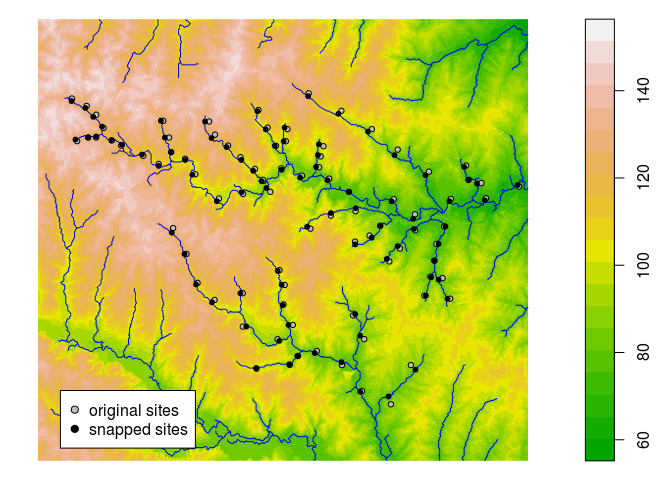
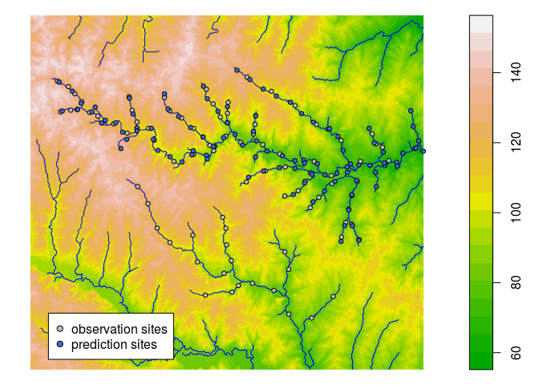

openSTARS
=============


## Introduction
`openSTARS` is an open source implementation of the STARS toolbox (Peterson & Ver Hoef, 2014) using R and GRASS GIS.
It prepares the .ssn object needed for the SSN package.
A digital elevation model (DEM) is used to derive stream networks (in contrast to STARS that can clean an existing stream network). The reason for this is that existing stream networks (e.g. obtained as shape files) very often contain loops and dead ends that hinder building a valid topography for them.

For more information on STARS and SSN, see [their web page](http://www.fs.fed.us/rm/boise/AWAE/projects/SpatialStreamNetworks.shtml).

Peterson, E. E., & Ver Hoef, J. M. (2014). STARS: An ArcGIS Toolset Used to Calculate the Spatial Information Needed to Fit Spatial Statistical Models to Stream Network Data. J Stat Softw, 56(2), 1–17.

## Installation and loading
A functional installation of [GRASS GIS (>=7.0)](https://grass.osgeo.org/#) with installed add-ons [r.stream.basins](https://grass.osgeo.org/grass70/manuals/addons/r.stream.basins.html), [r.stream.distance](https://grass.osgeo.org/grass70/manuals/addons/r.stream.distance.html), [r.stream.order](https://grass.osgeo.org/grass70/manuals/addons/r.stream.order.html) and 
[r.hydrodem](https://grass.osgeo.org/grass70/manuals/addons/r.hydrodem.html) is needed.
These add-ons can be installed from within GRASS using the console and g.extension or in the GUI under 'Settings'/'Addons extensions'/'Install extensions from add-ons' under 'raster'.

**UPDATE!!**

```r
install.packages("devtools")
devtools::install_github("MiKatt/openSTARS")
library("openSTARS")
```

## Basic usage

### Initiate an ephemeral GRASS session
First, a GRASS session must be initiated:

```r
library(openSTARS)
initGRASS(gisBase = "/usr/lib/grass72/",
          home = tempdir(),
          override = TRUE)
#> gisdbase    /tmp/RtmpPE5rka 
#> location    file3069678f9266 
#> mapset      file306975285640 
#> rows        1 
#> columns     1 
#> north       1 
#> south       0 
#> west        0 
#> east        1 
#> nsres       1 
#> ewres       1 
#> projection  NA
```

Alternatively, the path to a specific GRASS database directory and a Location name can be provided.

```r
library(openSTARS)
initGRASS(gisBase = "/usr/lib/grass72/",
          home = tempdir(),
          gisDbase = "./GRASSDB",
          location = "test_openSTARS",
          remove_GISRC = T,
          override = TRUE)
```

### Setup GRASS and load data into GRASS
The path to the digital elevation model (DEM) and the observation sites must be
provided. Additionally, the path to a stream network, which can be burnt into the
DEM before extracting the streams, can be given.

First, `setup_grass_environment` prepares the GRASS environment by setting

 * the projection to that one of the observation sites or to an epsg code provided
 * the region to the extent of the DEM.
 
For more information on the concept of GRASS Locations, Mapsets etc. see the [GRASS GIS Quickstart](https://grass.osgeo.org/grass73/manuals/helptext.html).


```r
dem_path <- system.file("extdata", "nc", "elev_ned_30m.tif", package = "openSTARS")
sites_path <- system.file("extdata", "nc", "sites_nc.shp", package = "openSTARS")

setup_grass_environment(dem = dem_path, sites = sites_path)
#> Setting up GRASS Environment...

gmeta()
```

Then, use `import_data` to import all data into GRASS (DEM, observations sites and optionally stream network)

```r
import_data(dem = dem_path, sites = sites_path)
#> Loading DEM into GRASS...
#> Loading sites into GRASS...
#> No streams available, skipping.
```

The DEM is loaded into the GRASS database as raster map named `dem`, the sites as vector map named `sites_o` and the (optional) stream network as vector map named `streams_o`.
Here's how the data looks like:


```r
dem <- readRAST("dem", ignore.stderr = TRUE)
sites <- readVECT("sites_o", ignore.stderr = TRUE)
plot(dem, col = terrain.colors(20))
cols <- colorRampPalette(c("blue", "red"))(length(sites$value))[rank(sites$value)]
points(sites, pch = 16, col = cols)
```

<!-- -->

### Derive streams from DEM
Next, the streams should be derived from the DEM.

```r
derive_streams()
#> Conditioning DEM...
#> Deriving streams from DEM...
#> Calculating stream topology...
```
An existing stream network (if provided to `import_data` before) can be burnt into the DEM to force the streams derived from the DEM to the existing one. Additionally, other specifications on how the streams shall be created can be provided (see `?derive_streams` and  [r.stream.extract](https://grass.osgeo.org/grass73/manuals/r.stream.extract.html) for details).


```r
derive_streams(burn = 10, accum_threshold = 1000)
```


```r
dem <- readRAST("dem", ignore.stderr = TRUE)
streams <- readVECT("streams_v", ignore.stderr = TRUE)
plot(dem, col = terrain.colors(20))
lines(streams, col = "blue")
points(sites, pch = 16, col = cols)
```

<!-- -->

### Check the network
Next, the stream network should be checked if there are stream segments with more than two inflows. This must be corrected because the .ssn object must not have such complex junctions. In the nc data set provided, there will be no complex junctions.


```r
cp <- check_compl_junctions()
if (cp)
  correct_compl_junctions()
```

### Prepare edges
Now, information needed for the .ssn object can be derived for the streams and stored in a new vector map `edges`.


```r
calc_edges()
```


```r
edges <- readVECT("edges", ignore.stderr = TRUE)
head(edges@data, n=4)
#>   cat stream prev_str01 prev_str02 next_str flow_accu netID rid  Length
#> 1   1      1          0          0       30  903.7007    15   0 1268.53
#> 2   2      2          0          0       15 1893.0472    15   1 1006.69
#> 3   3      3          0          0       51 6130.5509    14   2 4298.01
#> 4   4      4          0          0       -1 3123.5889     1   3 2657.06
#>   sourceDist   upDist H2OArea rcaArea
#> 1    1268.53 19128.73  1.0674  1.0674
#> 2    1006.69 21908.81  1.3473  1.3473
#> 3    4298.01 13038.00  5.5233  5.5233
#> 4    2657.06  2657.06  2.8305  2.8305
```

`edges` now holds the derived network plus attributes needed for the .ssn object

* network identifier (netID)
* reach identifier (rid)
* stream segment length (length)
* distance from the source (sourceDist)
* upstream distance, i.e. distance from the outlet of the network to the outflow of the stream segment (upDist)
* total catchment area (H2OArea)
* reach contributing area (rcaArea)

The additional fields hold information about the network: 'next_str' is the 'stream' this segment flows into, 'prev_str01' and 'prev_str02' are the two segments that flow into this segment.

### Prepare sites
Often, survey sites do not lay exactly on the stream network (due to GPS imprecision, stream representation as lines, derivation of streams from a DEM, etc.). To assign an exact position of the sites on the network they are moved to the closest stream segment (snapped) using
[v.distance](https://grass.osgeo.org/grass73/manuals/v.distance.html). Additionally, attributes needed for .ssn object are assigned: 

```r
calc_sites()
sites <- readVECT("sites", ignore.stderr = TRUE)
head(sites@data)
```

* point identifier (pid)
* location identifier (locID) 
* network identifier (netID)
* reach identifier of the edge segment the point lies on (rid)
* upstream distance (upDist), i.e. the distance to the network outlet calculated using [r.stream.distance](https://grass.osgeo.org/grass70/manuals/addons/r.stream.distance.html).
* distance ratio, i.e. the ratio of the distance from the outflow of the edge to the point along the edge and the total length of the edge segment (distRatio).

Additional fields hold information on the snapping: distance of the original site to the closest edge (dist), i.e. how far the point was moved, and the new x and y coordinates (xm, ym). The filed 'cat_edge' gives the 'cat' of the stream segment the point lies on (equivalent to 'rid').


```r
dem <- readRAST("dem", ignore.stderr = TRUE)
#> Creating BIL support files...
#> Exporting raster as floating values (bytes=4)
#>    0%   3%   6%   9%  12%  15%  18%  21%  24%  27%  30%  33%  36%  39%  42%  45%  48%  51%  54%  57%  60%  63%  66%  69%  72%  75%  78%  81%  84%  87%  90%  93%  96%  99% 100%
sites <- readVECT("sites", ignore.stderr = TRUE)
sites_orig <- readVECT("sites_o", ignore.stderr = TRUE)
edges <- readVECT("edges", ignore.stderr = TRUE)
plot(dem, col = terrain.colors(20))
lines(edges, col = "blue")
points(sites_orig, pch = 21, cex=0.75, bg = "grey")
points(sites, pch = 20, col = "black")
```

<!-- -->

### Prepare prediction sites
Prediction sites can be created along the streams. Either the distance between the sites must be provided (`dist`) or the approximate number of sites that shall be created (`nsites`). Additionally, the creation can be restricted to a certain networks (`netIDs`).

Similar as for the observation sites, attributes needed for .ssn object are assigned: 

* point identifier (pid)
* location identifier (locID) 
* network identifier (netID)
* reach identifier of the edge segment the point lies on (rid)
* upstream distance (upDist), i.e. the distance to the network outlet calculated using [r.stream.distance](https://grass.osgeo.org/grass70/manuals/addons/r.stream.distance.html).
* distance ratio, i.e. the ratio of the distance from the outflow of the edge to the point along the edge and the total length of the edge segment (distRatio).

The filed 'cat_edge' gives the 'cat' of the stream segment the point lies on (equivalent to 'rid').


```r
calc_prediction_sites(predictions = "preds", nsites = 100, netIDs = 15 )
```


```r
dem <- readRAST("dem", ignore.stderr = TRUE)
#> Creating BIL support files...
#> Exporting raster as floating values (bytes=4)
#>    0%   3%   6%   9%  12%  15%  18%  21%  24%  27%  30%  33%  36%  39%  42%  45%  48%  51%  54%  57%  60%  63%  66%  69%  72%  75%  78%  81%  84%  87%  90%  93%  96%  99% 100%
sites <- readVECT("sites", ignore.stderr = TRUE)
pred_sites <- readVECT("preds", ignore.stderr = TRUE)
edges <- readVECT("edges", ignore.stderr = TRUE)
plot(dem, col = terrain.colors(20))
lines(edges, col = "blue")
points(sites, pch = 21, cex=0.75, bg = "grey")
points(pred_sites, pch = 20, col = "black")
```

<!-- -->

```r
head(pred_sites@data)
#>   cat cat_edge         dist pid rid locID netID   upDist distRatio
#> 1   1        1 0.000000e+00   1   0     1    15 18452.04 0.4665558
#> 2   2        1 2.910383e-11   2   0     2    15 19128.73 1.0000000
#> 3   3        2 0.000000e+00   3   1     3    15 21076.97 0.1736880
#> 4   4        2 0.000000e+00   4   1     4    15 21751.53 0.8437652
#> 5   5        5 2.910383e-11   5   4     5    15 21094.54 0.1024687
#> 6   6        5 2.910383e-11   6   4     6    15 21741.23 0.4468300
```

### Calculate attributes from raster maps
Attributes (i.e. predictor variables for the .ssn object) can be calculated for observation and prediction sites. There are two ways to calculates attributes: 

1. approximately as described in Peterson & Ver Hoef, 2014: STARS: An ARCGIS Toolset Used to Calculate the Spatial Information Needed to Fit Spatial Statistical Models to Stream Network Data. J. Stat. Softw., 56 (2).
1. exactly by intersecting the catchment of each point with raster maps;

For the approximate calculation, first attributes must be intersected with the sub-catchments of the stream segments and then they are calculated for each site based on the distance ratio of the point. Note that the sub-catchment area 'H2OArea' for each stream segment is calculated automatically in calc_edges.


```r
# calculates slope from DEM as an example attribute
execGRASS("r.slope.aspect", flags = c("overwrite","quiet"),
          parameters = list(
            elevation = "dem",
            slope = "slope"
          ))
# calculate average slope per sub-catchment of each stream segment
calc_attributes_edges(input_raster = "slope", stat = "mean",
                      attr_name = "avSlo", round_dig = 4, clean = T)
# calculate approx. catchment area and average slope per catchment of each site
calc_attributes_sites_approx(sites_map = "sites",
                             input_attr_name = "avSlo",
                             output_attr_name = "avSloA",
                             stat = "mean")
sites <- readVECT("sites", ignore.stderr = TRUE)
head(sites@data)
#>   cat cat_ value cat_edge       dist       xm       ym pid locID netID rid
#> 1   1    1     1        5  79.907826 631046.1 226074.1   1     1    15   4
#> 2   2    2     2        5  76.098623 631495.3 225849.5   2     2    15   4
#> 3   3    3     1        5 112.904797 631787.3 225580.0   3     3    15   4
#> 4   4    4     1        5  61.158605 632011.9 225175.7   4     4    15   4
#> 5   5    5     1        2  72.041077 631203.4 224771.5   5     5    15   1
#> 6   6    6     2        2   4.226159 631540.2 224883.8   6     6    15   1
#>     upDist distRatio H2OAreaA avSloA
#> 1 22490.35 0.8457352     0.38 3.2165
#> 2 21983.36 0.5757639     1.04 3.2165
#> 3 21613.95 0.3790536     1.53 3.2165
#> 4 21166.97 0.1410375     2.11 3.2165
#> 5 21823.95 0.9157039     0.11 2.6833
#> 6 21359.39 0.4542312     0.74 2.6833
```

The exact calculation of attribute values for the total catchment of each point can take quite long (depending on the number of points) because for each point the total catchment is first delineated based on the DEM and then intersected with the raster map(s) provided. Note that if no raster map is provided the total catchment area for each point is calculated.


```r
# calculates slope from DEM as an example attribute
execGRASS("r.slope.aspect", flags = c("overwrite","quiet"),
          parameters = list(
            elevation = "dem",
            slope = "slope"
          ))
# calculate exact catchment area and average slope per catchment of each site
calc_attributes_sites_exact(sites_map = "sites", 
                            input_raster = "slope",
                            stat = "mean",
                            attr_name = "avSloE", 
                            round_dig = 4)
#> Exporting 87 features...
#>    5%  11%  17%  24%  31%  37%  43%  49%  55%  62%  68%  74%  80%  86%  93% 100%
#> v.out.ogr complete. 87 features (Point type) written to <sites> (SQLite
#> format).
#> OGR data source with driver: SQLite 
#> Source: "/tmp/RtmpPE5rka/file3069678f9266/PERMANENT/.tmp/mira-Linux/629.0", layer: "sites"
#> with 87 features
#> It has 15 fields
sites <- readVECT("sites", ignore.stderr = TRUE)
head(sites@data)
#>   cat cat_ value cat_edge       dist       xm       ym pid locID netID rid
#> 1   1    1     1        5  79.907826 631046.1 226074.1   1     1    15   4
#> 2   2    2     2        5  76.098623 631495.3 225849.5   2     2    15   4
#> 3   3    3     1        5 112.904797 631787.3 225580.0   3     3    15   4
#> 4   4    4     1        5  61.158605 632011.9 225175.7   4     4    15   4
#> 5   5    5     1        2  72.041077 631203.4 224771.5   5     5    15   1
#> 6   6    6     2        2   4.226159 631540.2 224883.8   6     6    15   1
#>     upDist distRatio H2OAreaA avSloA H2OArea avSloE
#> 1 22490.35 0.8457352     0.38 3.2165  1.0476 2.8314
#> 2 21983.36 0.5757639     1.04 3.2165  1.6569 3.0192
#> 3 21613.95 0.3790536     1.53 3.2165  1.8675 3.0915
#> 4 21166.97 0.1410375     2.11 3.2165  2.4192 3.1704
#> 5 21823.95 0.9157039     0.11 2.6833  0.6696 2.3850
#> 6 21359.39 0.4542312     0.74 2.6833  1.0998 2.5393
```

In both alternatives, the catchment area for each site is calculated automatically ('H2OAreaA' for `calc_attributes_sites_appox` and 'H2OArea' for `calc_attributes_sites_exact`).

### Write all files to an ssn folder
All files needed (edges, sites and optionally prediction sites) are written to the file path provided and can then be read in by the SSN package.


```r
ssn_dir <- file.path(tempdir(), 'nc.ssn')
export_ssn(ssn_dir)
list.files(ssn_dir)
#>  [1] "edges.dbf"   "edges.prj"   "edges.shp"   "edges.shx"   "netID10.dat"
#>  [6] "netID11.dat" "netID12.dat" "netID13.dat" "netID14.dat" "netID15.dat"
#> [11] "netID16.dat" "netID1.dat"  "netID2.dat"  "netID3.dat"  "netID4.dat" 
#> [16] "netID5.dat"  "netID6.dat"  "netID7.dat"  "netID8.dat"  "netID9.dat" 
#> [21] "sites.dbf"   "sites.prj"   "sites.shp"   "sites.shx"
```


#### Try with SSN package

```r
library(SSN)
# import
ssn_obj <- importSSN(ssn_dir, o.write = TRUE)
plot(ssn_obj, 'value')
```

<!-- -->

```r

# Create Distance Matrix
createDistMat(ssn_obj, o.write = TRUE)
dmats <- getStreamDistMat(ssn_obj)

ssn_obj.Torg <- Torgegram(ssn_obj, "value", nlag = 20, maxlag = 15000)
plot(ssn_obj.Torg)
```

<!-- -->

```r

names(ssn_obj@data)
#>  [1] "cat"        "flow_accu"  "netID"      "rid"        "Length"    
#>  [6] "sourceDist" "upDist"     "H2OArea"    "rcaArea"    "cat_"      
#> [11] "avSlo_e"    "avSlo_c"
names(ssn_obj)
#> $Obs
#>  [1] "cat"       "cat_"      "value"     "cat_edge"  "dist"     
#>  [6] "xm"        "ym"        "pid"       "locID"     "netID"    
#> [11] "rid"       "upDist"    "distRatio" "H2OAreaA"  "avSloA"   
#> [16] "H2OArea"   "avSloE"
ssn_obj <- additive.function(ssn_obj, "H2OArea", "computed.afv")

# non-spatial model
ssn_obj.glmssn0 <- glmssn(value ~ upDist, ssn.object = ssn_obj,
                            CorModels = NULL)
summary(ssn_obj.glmssn0)
#> 
#> Call:
#> glmssn(formula = value ~ upDist, ssn.object = ssn_obj, CorModels = NULL)
#> 
#> Residuals:
#>     Min      1Q  Median      3Q     Max 
#>      NA -2.4153 -0.2151  2.6684      NA 
#> 
#> Coefficients:
#>               Estimate Std. Error t value Pr(>|t|)    
#> (Intercept)  6.655e+00  6.868e-01   9.690  < 2e-16 ***
#> upDist      -1.951e-04  5.799e-05  -3.365  0.00117 ** 
#> ---
#> Signif. codes:  0 '***' 0.001 '**' 0.01 '*' 0.05 '.' 0.1 ' ' 1
#> 
#> Covariance Parameters:
#>  Covariance.Model Parameter Estimate
#>            Nugget   parsill     8.51
#> 
#> Residual standard error: 2.91691
#> Generalized R-squared: 0.1213394
# same as
summary(lm(value ~ upDist, getSSNdata.frame(ssn_obj)))
#> 
#> Call:
#> lm(formula = value ~ upDist, data = getSSNdata.frame(ssn_obj))
#> 
#> Residuals:
#>     Min      1Q  Median      3Q     Max 
#> -4.9690 -2.4153 -0.2151  2.6684  5.0848 
#> 
#> Coefficients:
#>               Estimate Std. Error t value Pr(>|t|)    
#> (Intercept)  6.655e+00  6.868e-01   9.690 3.06e-15 ***
#> upDist      -1.951e-04  5.799e-05  -3.365  0.00117 ** 
#> ---
#> Signif. codes:  0 '***' 0.001 '**' 0.01 '*' 0.05 '.' 0.1 ' ' 1
#> 
#> Residual standard error: 2.917 on 82 degrees of freedom
#>   (3 observations deleted due to missingness)
#> Multiple R-squared:  0.1213,	Adjusted R-squared:  0.1106 
#> F-statistic: 11.32 on 1 and 82 DF,  p-value: 0.001166


# # # spatial model
ssn_obj.glmssn1 <- glmssn(value ~ upDist , ssn.object = ssn_obj,
                            CorModels = c("Exponential.taildown", "Exponential.tailup"),
                          addfunccol = "computed.afv")
summary(ssn_obj.glmssn1)
#> 
#> Call:
#> glmssn(formula = value ~ upDist, ssn.object = ssn_obj, CorModels = c("Exponential.taildown", 
#>     "Exponential.tailup"), addfunccol = "computed.afv")
#> 
#> Residuals:
#>     Min      1Q  Median      3Q     Max 
#>      NA -2.1099 -0.1461  2.8481      NA 
#> 
#> Coefficients:
#>               Estimate Std. Error t value Pr(>|t|)    
#> (Intercept)  6.138e+00  1.195e+00   5.136   <2e-16 ***
#> upDist      -1.642e-04  9.382e-05  -1.750   0.0839 .  
#> ---
#> Signif. codes:  0 '***' 0.001 '**' 0.01 '*' 0.05 '.' 0.1 ' ' 1
#> 
#> Covariance Parameters:
#>      Covariance.Model Parameter   Estimate
#>    Exponential.tailup   parsill     7.3759
#>    Exponential.tailup     range 98497.1672
#>  Exponential.taildown   parsill     0.0230
#>  Exponential.taildown     range 69256.8975
#>                Nugget   parsill     2.3826
#> 
#> Residual standard error: 3.127556
#> Generalized R-squared: 0.03521677
varcomp(ssn_obj.glmssn1)
#>                VarComp  Proportion
#> 1    Covariates (R-sq) 0.035216775
#> 2   Exponential.tailup 0.727504029
#> 3 Exponential.taildown 0.002272824
#> 4               Nugget 0.235006373
```


### Contributors

+ [Mira Kattwinkel](https://github.com/MiKatt)
+ [Eduard Szöcs](https://github.com/EDiLD)

### Want to contribute?

Checkout our [contribution guide here](https://github.com/edild/openSTARS/blob/master/CONTRIBUTING.md).

### Meta

* Please [report any issues, bugs or feature requests](https://github.com/MiKatt/openSTARS/issues).
* License: MIT
