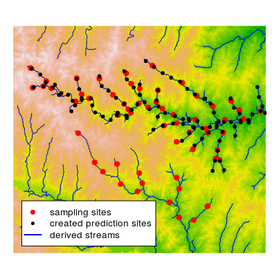

# New package openSTARS
Mira Kattwinkel  
August 10, 2017  

## openSTARS prepares GIS data for stream network analysis
'openSTARS' is based on open source software ('R' and 'GRASS GIS') to prepare the
input data for the 'R' package 'SSN' for Spatial Statistical Modeling on Stream Networks.
It is intended as an alternative to the 'ArcGIS' toolbox 'STARS' [@peterson2014]. 

'SSN' [@hoef2014, [link](http://www.fs.fed.us/rm/boise/AWAE/projects/SpatialStreamNetworks.shtml)]
enables the statistical analysis of stream monitoring data based on regression models
and accounts for patterns of spatial autocorrelation among sampling locations.
'openSTARS' formates the required GIS data to be read into 'SSN'.

 

## Input data
Required:

* sampling locations (vector data, e.g., ESRI shapefile)
* digital elevation model (raster data, e.g., tiff)

Optional:

* stream network (vector data, e.g., ESRI shapefile)
* predictions sites (vector data, e.g., ESRI shapefile)
* potential explanatory variables (raster data, e.g., tiff)

## Workflow
A full example can be found [here](https://github.com/MiKatt/openSTARS/blob/master/README.md).

## References
